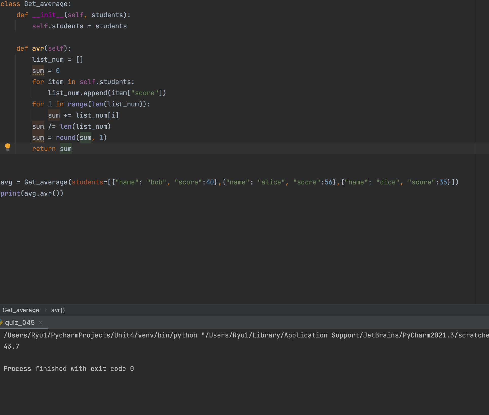

### produce a the average score of the students in the class

```.py
class Get_average:
    def __init__(self, students):
        self.students = students

    def avr(self):
        list_num = []
        sum = 0
        for item in self.students:
            list_num.append(item["score"])
        for i in range(len(list_num)):
            sum += list_num[i]
        sum /= len(list_num)
        sum = round(sum, 1)
        return sum
```


