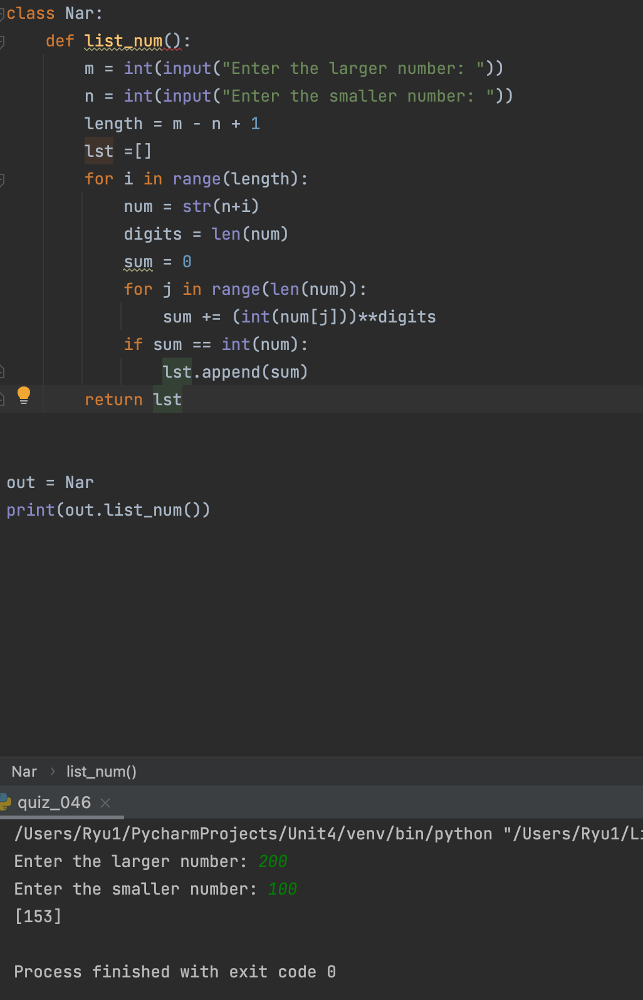

### Narcissistic Numbers

```.py
class Nar:
    def list_num():
        m = int(input("Enter the larger number: "))
        n = int(input("Enter the smaller number: "))
        length = m - n + 1
        lst =[]
        for i in range(length):
            num = str(n+i)
            digits = len(num)
            sum = 0
            for j in range(len(num)):
                sum += (int(num[j]))**digits # adds exponentiate the value by the number of digits to the sum 
            if sum == int(num):
                lst.append(sum)
        return lst
```


