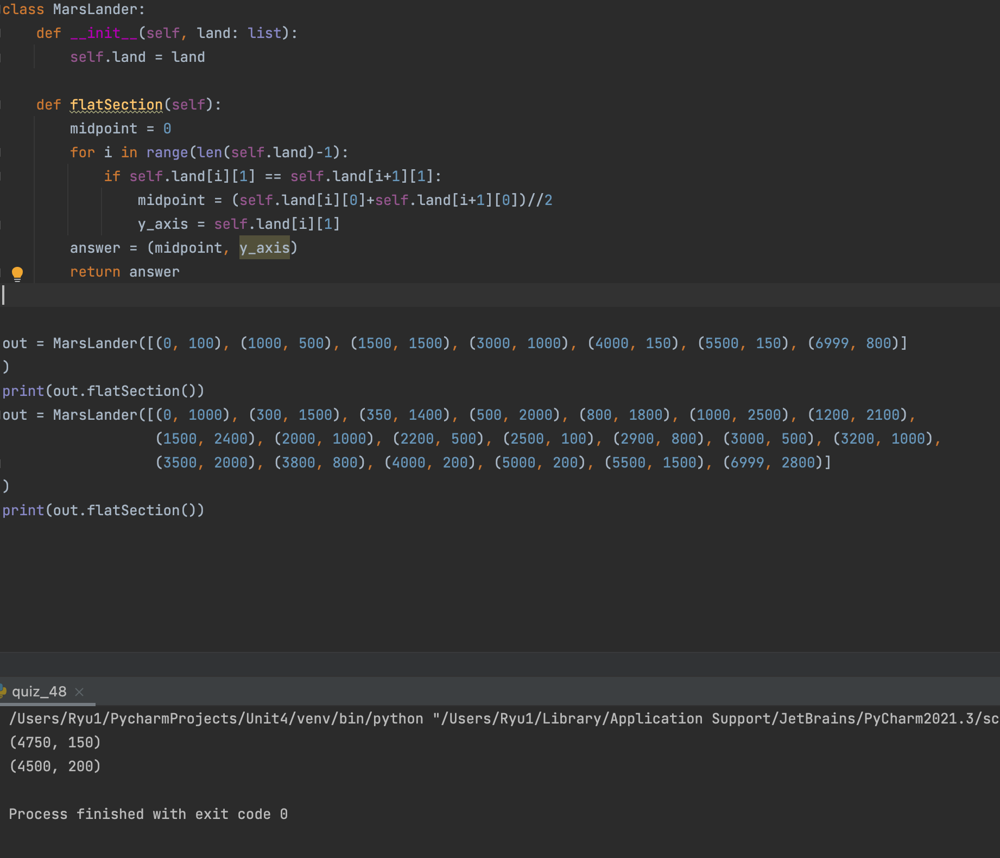

### Mars Lander

```.py
class MarsLander:
    def __init__(self, land: list):
        self.land = land

    def flatSection(self):
        midpoint = 0
        for i in range(len(self.land)-1):
            if self.land[i][1] == self.land[i+1][1]:
                midpoint = (self.land[i][0]+self.land[i+1][0])//2 # extract the x values from the data that has two identicle y values
                y_axis = self.land[i][1]
        answer = (midpoint, y_axis)
        return answer
```


