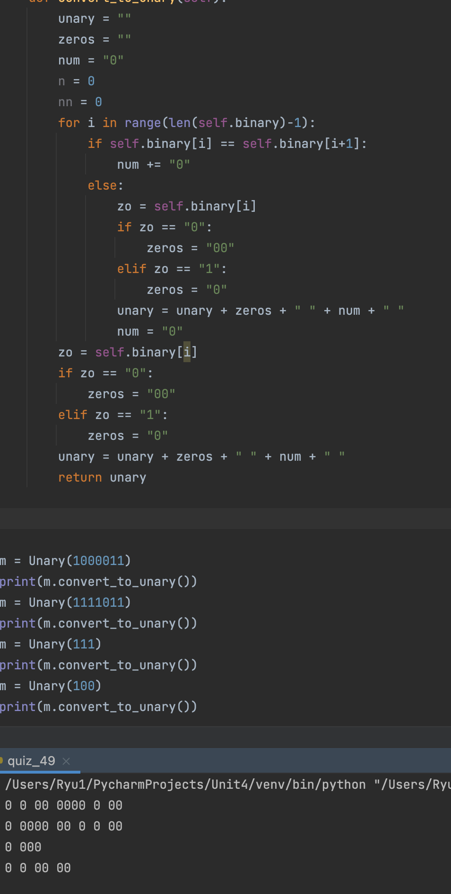

### Unary

```.py
class Unary:
    def __init__(self, binary:int):
        self.binary = str(binary)

    def convert_to_unary(self):
        unary = ""
        zeros = "" # if it is a succession of 0 or 1
        num = "0" # the length of succession
        for i in range(len(self.binary)-1):
            if self.binary[i] == self.binary[i+1]: # when the number is the same as the number besides
                num += "0"
            else:
                zo = self.binary[i] # what number the sequence consists of
                if zo == "0":
                    zeros = "00"
                elif zo == "1":
                    zeros = "0"
                unary = unary + zeros + " " + num + " "
                num = "0"
        zo = self.binary[i] # make another round of the loop
        if zo == "0":
            zeros = "00"
        elif zo == "1":
            zeros = "0"
        unary = unary + zeros + " " + num + " "
        return unary
```


